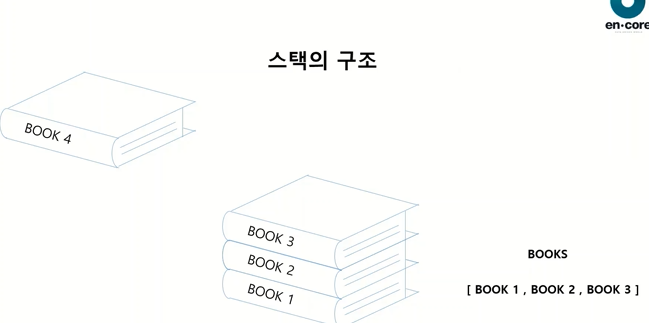
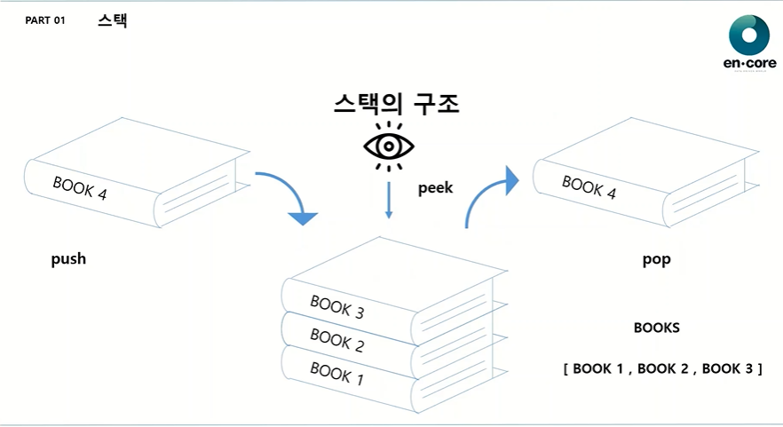
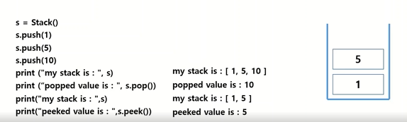
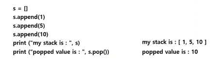
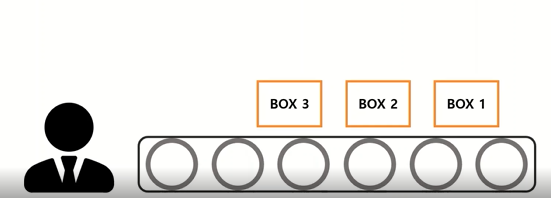
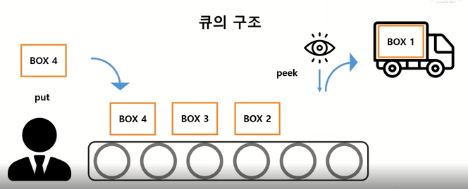
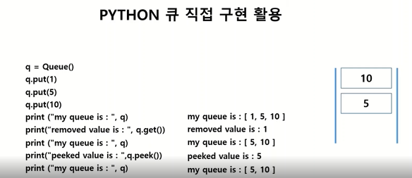
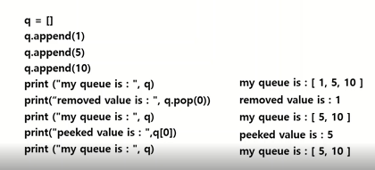
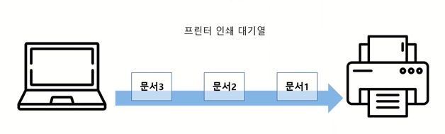

# 									**알고리즘  1주차 특강**

## **- 스택과 큐**

1. **PART01**

**스택이란?**

**영어로 Stack '쌓다' 라는 의미. 프로그래밍에서 목록 혹은 리스트에서 접근이 한 쪽에서만 가능한 구조. LIFO(Last-In, First-Out)가 기본원리이다.**

**스택의 구조**

| **** | **** |
| ------------------------------------------------------------ | ------------------------------------------------------------ |

**Push**

**: 리스트로 BOOK1~3까지 두고 BOOK4를 추가하려고할 때 특정이유없인 위에 책을 둔다**

**Peek**

**: 가장 마지막 들어간 데이터가 무엇인지 확인하는 함수**

**pop**

**: stack에서 제일 마지막에 넣은 데이터를 추출하는 함수** 

**PYTHON 스택의 구현방법**

1. **직접구현**

   **: class Stack(list) -  push = list.append**

    **def peek(self) : return self[-1] self[len(self)-1]**

   **Pop은 list의 내장함수로 구현되어있다.**

   - **활용**
   - ****

**스택은 말그대로 한 단계씩 차례대로 쌓아가는 구조적인 특징을 가지고있습니다.**

1. **이미 구현된 클래스 import**

2. **List를 스택으로 구현**

   ****
   
   
   
   
   
   **하지만 stack에선 2,3번을 쓰지않는다. 그 이유로는 Python은 List가 스택으로 사용 가능하도록 구현되었기때문이다.** 

**스택의 대표적인 예시는 우리가 유튜브를 볼 때 첫 번째 홈에서 저장되어있다가 영상을 시청하면 다음 페이지가 저장되고 다시 홈으로 돌아가고싶으면 돌아가기를 쓰면 된다.**

2. **PART02**

**큐란?**

**영어로 Queue '일이 처리되기를 기다리는 리스트' 라는 의미이다.**

**프로그래밍에서 목록 혹은 리스트에서 접근이 양쪽에서 가능한 구조로 FIFO(First-in First-out)가 기본원리이다.**

| **** | **** |
| ------------------------------------------------------------ | ------------------------------------------------------------ |

**큐는 보시는 바와 같이 한쪽에서 삽입과 삭제가 이루워지는 스택과  달리 삭제연산만 수행되는 곳과 삽입연산만 수행되는 곳으로 나뉘어지고있습니다.**

**PYTHON 큐의 구현방법**

1. **직접 구현**

   **class Queue(list):**

   ​	**put = list.append**

    	def peek(self):

   ​		**return self[0]**

   ​	**def get(self):**

   ​		**return self.pop(0)**

   - **활용**

     ****

     
     
     **보는 바와 같이 q에 1,5,10을 넣고 1을 제거 peek함수를 사용하여 마지막으로 들어간 수를 확인한다.**  

2. **이미 구현된 클래스 import**

   ****

3. **List를 큐로 구현**

   ****

**실제 활용**

- **프린터 인쇄 대기열** 

  ****

**문서3 -> 문서 2 -> 문서 1 순서대로 받아서 프린터로 출력하는 형태로 됩니다.**
